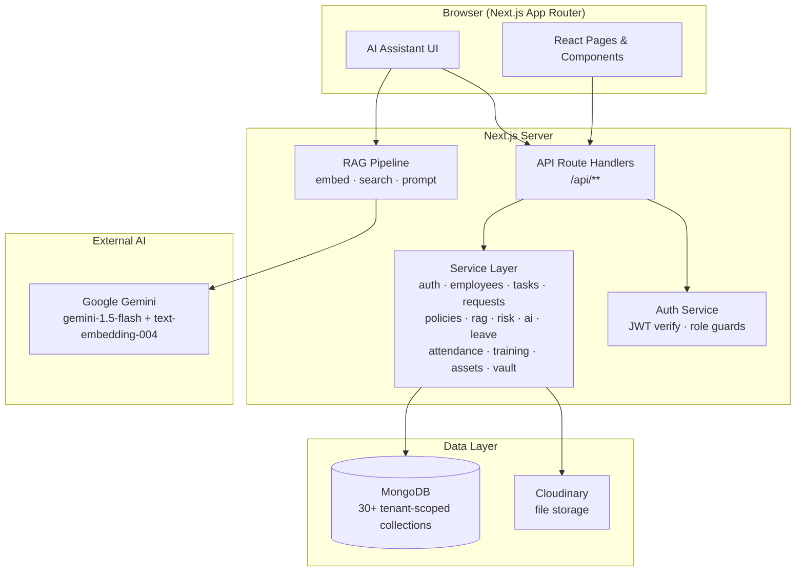
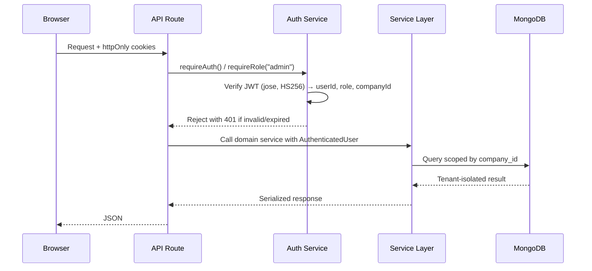
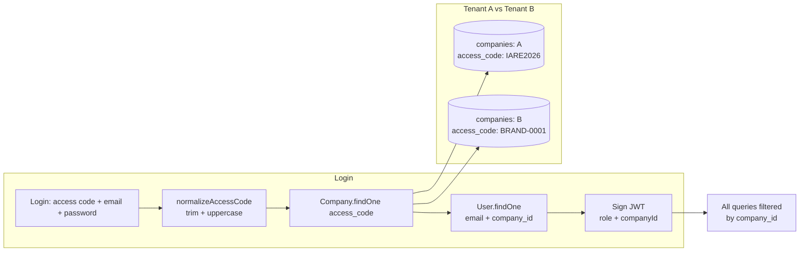
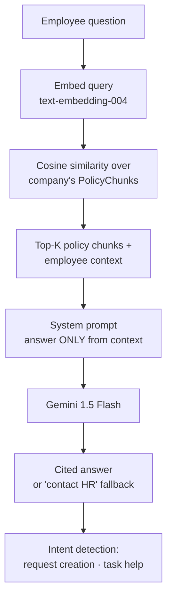
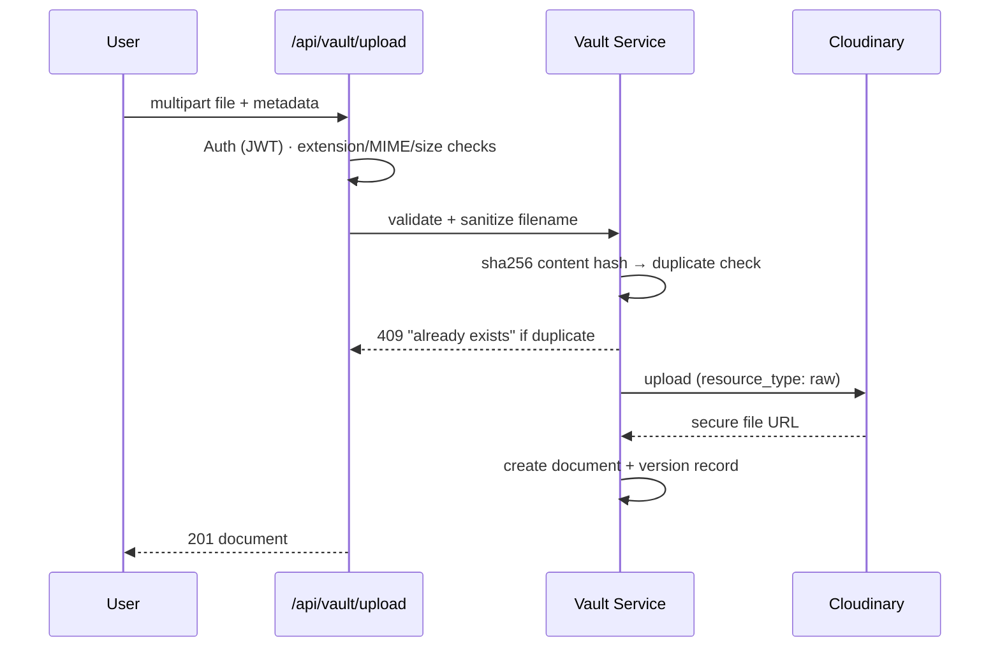

<div align="center">

# 🚀 OnboardAI

### Intelligent Employee Onboarding & Workforce Support Platform

A production-grade, **multi-tenant SaaS** that automates onboarding, tracks progress, answers HR & policy questions with an AI assistant, detects at-risk employees, and manages day-to-day HR operations — all in one place.


**Multi-tenant · Role-based · AI-powered · 89 passing tests**

</div>

---

## ✨ Why OnboardAI

Onboarding a new hire today means spreadsheets, lost emails, and manual follow-ups. OnboardAI replaces that chaos with:

- 🧾 **Self-serve onboarding** — role- and department-specific task checklists with progress tracking
- 🤖 **An AI assistant** that answers employee questions *from your actual policies* — with citations, not guesses
- ⚠️ **A deterministic risk engine** that flags struggling employees on real data (progress, overdue tasks, unresolved requests)
- 🏢 **Rock-solid tenant isolation** — every company gets its own world, protected at the data layer

---

## 🎯 Feature Highlights

| Area | Capabilities |
|------|-------------|
| **Company Access** | Auto-generated access codes (`MICRO-72KD`) that admins can customize (`IARE2026`), with instant effect on logins |
| **Authentication** | Email + password with JWT access/refresh cookie rotation, bcrypt hashing, forced password setup, invite-based joins |
| **Onboarding** | Template-driven task assignments (day 1 / first week / first month), mandatory tasks, per-employee checklists |
| **HR Dashboard** | KPI cards, department progress, risk distribution, AI-generated insights, employee table |
| **AI Assistant** | RAG pipeline over company policies + employee context (tasks, leaves, requests, assets, training) with source citations and intent detection |
| **Risk Engine** | Deterministic Green / Yellow / Red scoring from progress vs. expected, overdue tasks, and open requests |
| **Document Vault** | File uploads (15 types, 1 MB limit), duplicate detection via content hashing, version history, secure downloads |
| **Leave & Attendance** | Leave requests with balances & approvals, check-in/out with breaks |
| **Training & Rewards** | Courses with materials & quizzes, assignments, gamified badges & points |
| **More** | Announcements, calendar events & holidays, asset inventory, directory, notifications, support requests, analytics, invitations |

---

## 🧠 System Architecture

### High-Level Overview



### Request Flow (every API call)



### Multi-Tenancy & Company Access Codes

Every tenant-owned collection carries a `company_id`; every query is scoped to the authenticated user's company **server-side** — isolation is enforced at the data layer, not just in the UI.



- Codes are **globally unique** and admin-customizable (3–20 chars, `A-Z 0-9 - _`)
- Changing a code **takes effect immediately** — every login re-reads the code from the DB; no caching, no JWT changes, existing sessions stay valid

### AI Assistant & RAG Pipeline



### Document Vault Upload Flow



---

## 🛠 Tech Stack

| Layer | Technology |
|-------|-----------|
| Framework | [Next.js 16](https://nextjs.org) (App Router) + React 19 |
| Language | TypeScript (strict) |
| Styling | Tailwind CSS v4 + Lucide icons + Recharts |
| Database | MongoDB (Mongoose 9) — 30+ collections |
| Auth | Custom JWT (jose, HS256) — httpOnly cookies, refresh rotation, bcryptjs |
| AI Chat | Google Gemini 1.5 Flash |
| Embeddings | Google text-embedding-004 (RAG vector search) |
| File Storage | Cloudinary (raw resource type, tenant-prefixed paths) |
| Validation | Zod v4 |
| Testing | Vitest (89 tests: validation, access codes, vault upload, risk engine, RAG) |

---

## 📦 Getting Started

### Prerequisites

- Node.js 20+
- npm
- MongoDB (Atlas or local)
- (optional) Google Gemini API key, Cloudinary account

### 1. Install & Configure

```bash
npm install
cp .env.example .env.local
```

| Variable | Required | Description |
|----------|----------|-------------|
| `MONGODB_URI` | ✅ | MongoDB connection string |
| `JWT_SECRET` | ✅ | HS256 secret for access tokens |
| `JWT_REFRESH_SECRET` | ✅ | HS256 secret for refresh tokens |
| `GEMINI_API_KEY` | ✅ | Google AI Studio key (chat + embeddings) |
| `CLOUDINARY_CLOUD_NAME` | optional | Cloudinary cloud name (document vault) |
| `CLOUDINARY_API_KEY` | optional | Cloudinary API key |
| `CLOUDINARY_API_SECRET` | optional | Cloudinary API secret |
| `NEXT_PUBLIC_ALLOW_REGISTRATION` | optional | `"true"` to enable self-signup |
| `NEXT_PUBLIC_APP_NAME` | optional | App display name (default `OnboardAI`) |

### 2. Run

```bash
npm run dev
```

Open [http://localhost:3000](http://localhost:3000).

**First-time setup:** sign up with your company name — you'll get a Company Access Code instantly (e.g. `MICRO-72KD`). Share it with employees along with their email & password; they log in with all three. As admin, you can customize the code any time from **Company → Company Access Code**.

### 3. Test & Build

```bash
npm test          # vitest — 89 tests
npm run lint      # ESLint
npm run build     # production build
```

---

## 🧱 Project Structure

```
src/
├── app/
│   ├── api/                    # Route handlers (auth, employees, vault, leaves, …)
│   ├── dashboard/              # HR & employee dashboards
│   ├── assistant/              # AI assistant chat
│   ├── onboarding/             # Employee onboarding checklist
│   ├── documents/              # Document vault (upload / versions / download)
│   ├── employees/              # Directory + employee detail
│   ├── company/                # Company admin (access code, departments, roles)
│   ├── leaves/ · attendance/ · training/ · rewards/ · assets/
│   ├── announcements/ · calendar/ · notifications/ · directory/
│   ├── policies/ · requests/ · analytics/ · settings/ · setup/
│   ├── register/ · login/      # Company signup & login
│   └── page.tsx                # Landing page
├── components/
│   ├── ui/                     # Button, Card, Input, Select, Table, …
│   ├── layout/                 # Sidebar, navbar, app layout
│   └── vault/                  # Upload modal with progress & cancel
├── lib/
│   ├── services/               # Domain services (auth, employees, rag, risk, ai, …)
│   ├── models.ts               # All Mongoose schemas (30 collections)
│   ├── access-code.ts          # Code generation & validation
│   ├── env.ts                  # Typed env access + config checks
│   ├── validation.ts           # Zod schemas for every API contract
│   ├── db.ts                   # MongoDB connection with retry logic
│   └── serialize.ts            # Mongoose → plain-object serialization
├── __tests__/                  # Vitest unit tests
└── types/                      # Shared TypeScript types
```

---

## 🔒 Security & Design Principles

1. **Tenant isolation at the data layer** — every query carries `company_id`; duplicates of the same email across companies are fully separated.
2. **No LLM trust** — risk scores and progress metrics are computed deterministically from real data; the AI only writes human-readable explanations.
3. **Server-side authorization** — every route validates the JWT and role (`requireAuth` / `requireRole`) before touching data.
4. **Secrets never leave the server** — API keys live only in server code; the browser only ever sees `NEXT_PUBLIC_*` config.
5. **Secure uploads** — extension + MIME + size validation, sanitized filenames, sha256 duplicate detection, tenant-prefixed Cloudinary paths.
6. **Graceful degradation** — if Gemini is unavailable, the assistant falls back to rule-based answers; the app surfaces clear, actionable errors.

---

## 🚀 Deployment

### Vercel

```bash
npm run build
npx vercel --prod
```

Set all environment variables from `.env.local` in the Vercel dashboard (server-only variables must not be prefixed with `NEXT_PUBLIC_`).

### Docker

```dockerfile
FROM node:20-alpine
WORKDIR /app
COPY . .
RUN npm ci && npm run build
EXPOSE 3000
CMD ["npm", "start"]
```

---

## 📄 License

Private / Proprietary — for evaluation purposes only.
